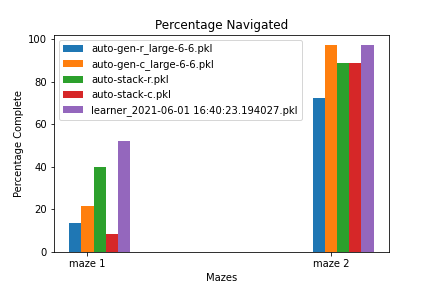
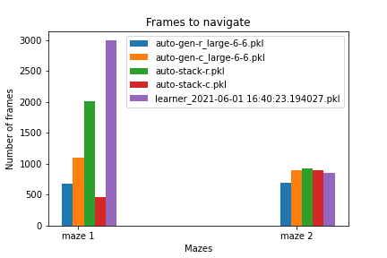

# Activities

## Model Assesment

- Worked on the tasks Jared assigned me
    - For Imitator.py I added some conditions so that the robot is running through the maze forever 
    - Imitator.py does checks every five frames if the robot is in a different location to see if it is stuck
    - Imitator.py delivers more diagnostics like maze percentage, frames, and video that are saved in an mp4 file
    - Ran an assesment on 5 models, which performed mediorce 
    - Ran four more model on larger dataets: two models on about (~30,000 images) and two models on (~90,000 images)
    - videos are now mp4's and do not take up 1GB

Attached are some results from the assesment: 

<video width="320" height="240" controls>
  <source src="prediction_2021-06-06 21_59_18.650443.mp4" type="video/mp4">
Your browser does not support the video tag.
</video>

## UnrealEngine
- Got started on UnrealEngine

# Issues

- Based on the model assesments the models perform poorly on large mazes
- There does not appear to be a particular "best" model. Sometimes classification outperforms regression and visa-versa 
- Unfortunately, models trained on even larger datasets did not show a drastic improvement in performance

# Plans

- Train models on larger mazes
    - AutomaterWrapper.py will come in handy for this
- Add more diagnostic metrics like time
- Learn more advanced modeling techniques, in other words keep going through FASTAI
