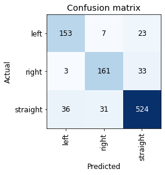

# Activities

## Unreal Engine Deep Learning

- Got Unreal Engine working on my pc!
    - Documented instructions
- Ran a model in the in UE environment and saw it turn a corner
- Replaced some of the functions in the UnrealUtils.py
    - Model doesn't go through walls anymore and UE wrapper takes in
    raycast starting location and converts them to UE coordinates

https://user-images.githubusercontent.com/40247275/121844718-3b300f00-cc99-11eb-956d-56a3c5f194ba.mov

## FastAI Deep Learning

- Made a proxy dataset for experimenting
- Applied Scikit-learn's weight formula: n_samples / (n_classes * np.bincount(y)) 
    - question: Should n_samples equal the number of samples in the training set or the entire datset 
    - Looks like the adding those weight's hindered the learner's performance

### Non-Weighted: 

### Weighted: 

### Diagnostics: 

- Imitate.py now saves everything in a folder

# Issues:

- Not sure how I can efficiently get rid of confusing images; I got the names of the images. I think one idea is the loop through those file names and called them in the terminal 
- Looking for a way to make maze generation in UE more autonomous 
- Applying my set of weights still don't produce a better confusion matrix

# Plans

## FastAI: 
- Improve Automater so that the model doesn't need to turn left or right when facing an arrow respectively 
- Get rid of confusing images in dataset
- Read cost-sensitive article and move forward accordingly

## UE
- Make UE Imitate files more robust
- Run the rest of the models in the UE environment

# Article Summaries

## OpenBot: Turning Smartphones into Robots

- 
