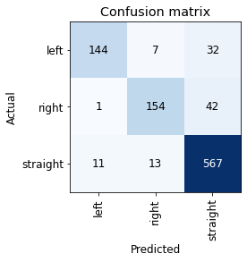

# Activities

## Unreal Engine Deep Learning

- Got Unreal Engine working on my pc!
    - Documented instructions
- Ran a model in the in UE environment and saw it turn a corner
- Replaced some of the functions in the UnrealUtils.py
    - Model doesn't go through walls anymore and UE wrapper takes in
    raycast starting location and converts them to UE coordinates

https://user-images.githubusercontent.com/40247275/121844718-3b300f00-cc99-11eb-956d-56a3c5f194ba.mov

## FastAI Deep Learning

- Made a proxy dataset for experimenting
- Applied Scikit-learn's weight formula: n_samples / (n_classes * np.bincount(y)) 
    - question: Should n_samples equal the number of samples in the training set or the entire datset 
    - Looks like the adding those weight's hindered the learner's performance

### Non-Weighted: 

### Weighted: 

### Diagnostics: 

- Imitate.py now saves everything in a folder

# Issues:

- Not sure how I can efficiently get rid of confusing images; I got the names of the images. I think one idea is the loop through those file names and called them in the terminal 
- Looking for a way to make maze generation in UE more autonomous 
- Applying my set of weights still don't produce a better confusion matrix

# Plans

## FastAI: 
- Improve Automater so that the model doesn't need to turn left or right when facing an arrow respectively 
- Get rid of confusing images in dataset
- Read cost-sensitive article and move forward accordingly

## UE
- Make UE Imitate files more robust
- Run the rest of the models in the UE environment

# Article Summaries

## OpenBot: Turning Smartphones into Robots

- The researchers designed an inexpensive robot that utilizes smart phones
- [Bluepring and Software](https://www.openbot.org)
- Three type of wheeled robots: 
    1. tiny robots - inexpensive but limited sensing 
    2. RC trucks - cutting-edge but expensive
    3. Educational e.g. Duckiebot
### Mechanical Design
- a single body cost ~ $50
- most expensive piece was an Arduino nano at $8
    - Smartphone connects to the Arduino
- 3D printed chasis
### Electrical design
- Serial communication link between smartphone and arduino

### Android App
- provides interface for operator, collect datasets, and run the higher-level perception
- Android Tensorflow Object Detection application
- can switch between neural networks
- model inspired by Conditional Imitation Learning [more on CIL](https://arxiv.org/pdf/1710.02410.pdf)
- trained model in Tensorflow

### Evaluation
- performanced was measured on distance, success rate, and collisions

### Results
- Nokia 2.2 performed the worst, but managed to follow the person for half the time
- the rest of the phones has high metrics in Distance and Success 

#### Autonomous Navigation

- Compared Driving policies: PiloNet(?) vs CIL vs researcher's policy

#### Neural Network

- Designed a NN in spirit of the command-input variant of Conditional Imitation Learning 
- trained the NN using the novel loss function
- used labeled data; concatenate command c
- Dataset Collection:
    1. Control signal by human operator via game controller
    2. record contraol signal and sensor data
    3. Noise Enabled
        - if yes: add noise to control 
            - apply control to robot
        - if no: apply control to robot
    4. repeat

- training process: 
    1. Sync images, sensor data, control
    2. Normalize images and controls to the rnge [0,1]
    3. Sample batch from DS
    4. Augmentation adjust saturation, hue, contrast, brightness
    5. Remove Steering bias: flip images and labels with probability 0.5
    6. Update dribing policy by optmizing our novel loss function
    7. repeat from step 4

Novel loss function: 
 

a^t = target action
a^p = predicted action
s^t = target steeing angle
w = (s^t + b)
b = bias to control the weight of samples with zero steering angle
action vector: a = (a_l, a_r), corresponding to left and right throttle
steering angle: s = a_l - a_r

Using Adam optmizer, they trainined all models for 100 epochs