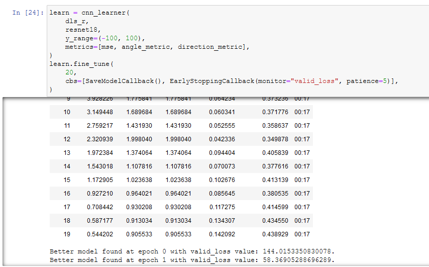

# Activities

## FasiAI Deep Learning

### Experimenting OpenBot Loss Function

- Tried implementing OpenBot's loss function. 
- Modified data labels so that angles are represented as throttles, to mimic motor throttles. 

While training the proxy dataset I found that the defaul loss function produced better metrics as shown in the picture below. 

- Some good news: included two different metrics that we can use for the regression models. 
    - These metrics measure angle and general direction accuracy

### Imitator

- Cleaned up ImitatorWrapper more
- In doing so, I found a few bugs I need to address

# Issues

- Imitator does not know when a model is going backwards but is still technically on the "right" path. 
- There could be some memory issues if I queue a list of models to imitate on multiple mazes
- OpenBot loss function is starting to look like a dead-end. 

# Plan

- Make polish up Imitator
- Make a function in MazeGen that will detect backwards movement 
- Read and Write more

# Article Summaries

## End to End Learning for Self-Driving Cars
**7-15-21**
Reseachers use a CNN to lean the "entire processing pipeline..." to steer an automobile. Theey used an RC car, DAVE, to collect data and test models. DAVE features a steering wheel, left, center, and right camera. The paper represents steering commands as $1/r$ where $r$ is the turning radius in meters. Training data are single images paired with the steering command. Training data from human driver is not sufficient, so they augment the data with additional images from different shifts from the center lane and rotations (PERTURBING!). For metrics, the paper used mean squared between the steering command output and the command of either the human driver or adjusted steering command for off-center rotated images. Their network consists of "9 layers, including a normalization layer, 5 convolutional layersand 3 fully connected layers". Researcher evaluate netowrk performance in simulation. I don't follow entirely with their simulator. Based on the diagram, they just took a video frame, augmented each frame and then passed in that frame  into a CNN. In evaluating the simulation tests, they measured autonomy, percentage of the time the network could drive. 

My take: Decent article that is mostly understandable. I actually think this paper is more closely related to our project than OpenBot. I say this because they used a car with a steering wheel, and so they got their steering angle from the wheel instead of two throttles. Moreover, they employed similar data collection techniques like perturbation. 

Questions: 
- What is singularity and what advantage does it serve to have the steering command be $1/r$?

# End-to-End Driving via Conditional Imitation Learning

The researchers in this paper used imitation learning to make an RC track navigate autonomously. They claim one limitation is in the assumption that optimal action can be inferred from the perceptual input alone. Thus, they present a conditional imitation model. In training their CI model, they label the perceptual input and control signal and also represent the expert's intention. The paper evaluates its model in a realistic simulation and on a robot truck. Training data is a set of action pairs generated by an "expert". The researcher highlight functions they try to minimize. 

**Network Architecture**

Model takes in images, measurements vector, and command (categorical one-hot encoded vector). Model's action space is continuous and two-dimentional: steering angle and acceleration. Papaer explore two network architectures. (a) command input: command is processed clong side image and measurement. (b) branched: command acts as a switch that selects between "specialized sub-actions". Images are 200x88. m=speed of car. All networks use the same architectures. The differences are the configuration of the modules and branches. Actions are two-dimensional vectors that collate steering angle and acceleration. Loss funcion is absolute squared error. 

**Training Data**

Data collected from expert agent led to models that did not lean how to recover from disturbances. Consequently, the researchers implemented perturbations :O The expert remains in the trajected loop, but collects data from two shifted cameras to the left and right. In other words, a three camera setup. Then, their automator corrects the noise and puts the agents back on track. Basically the wandering automator. 

**Simulation**

Used CARLA, an Unreal Engine simulator. 
