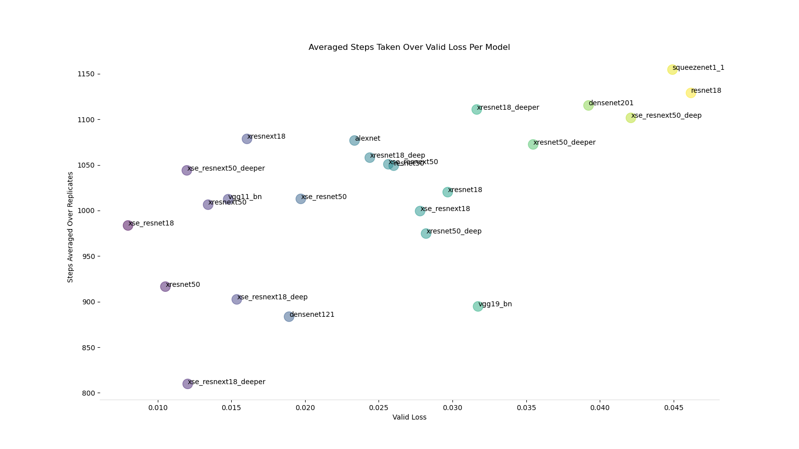

# Activities

## FasiAI Deep Learning

### Imitate

- Worked more on imitate plotting
- Added scatter plots which plot steps taken as a funtion of trainig/valid loss
- Added boxplots which plot steps taken as a function of mazes
- Successfully ran and plotted a 10 maze test on the uniform models

Completion bar plot:

Steps taken bar plot:

Maze Boxplot: 

Scatter plot

Train Averaged:

Train Per Replicate:

Valid Averaged: 

Valid Per Replicate:

# Issues

- 95% confidence intervals look wonky after a 10 maze test

# Plan

- Ask Prof Clark ideal bar plot diagrams
- Read more Pandas documentation and examples to work more efficiently